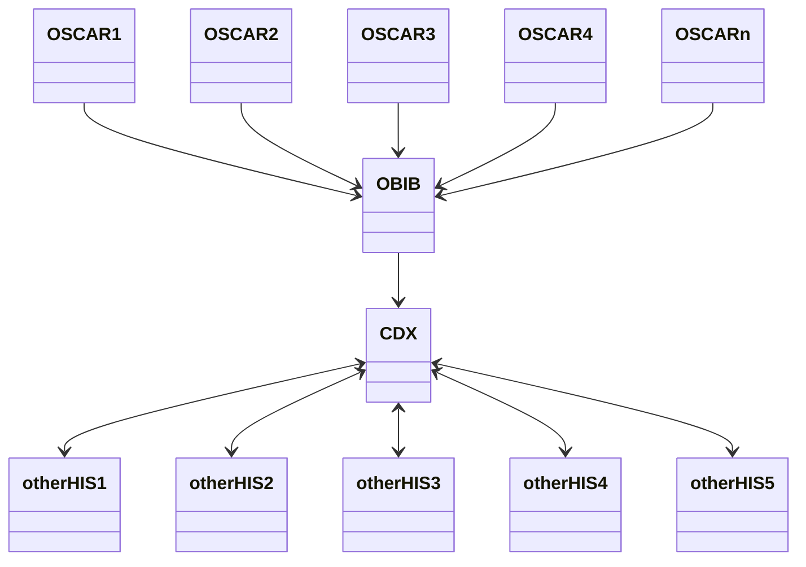

OSCAR EMR instances connect to the CDX message distribution system via the *Oscar Bidirectional Interoperability Bus* (**OBIB**). An OBIB can support many OSCAR instances. Therefore, an OSP only needs to operate one OBIB.



The server side of OBIB is implemented based on the interoperability engine [Mirth Connect](http://wiki.patesco.ca/doku.php?id=hl7:mirth:tutorial). Mirth Connect channels transform messages received from the OSCAR to CDA messages and send those messages to CDX through Web Services.

The OBIB depends on a series of software platforms, namely Mirth Connect, Java, MySQL/MariaDB, OpenSSL and NGINX. Thus, to simplify the OBIB installation, a production-ready Vagrant VM was created along with administrative scripts to manage the clinics within OBIB.

## Installing the VM for OBIB

The following steps create a Vagrant VM with OBIB ready for production.

Uncompress the **obib-&lt;version-number&gt;.zip** file and enter in the extracted folder **obib-&lt;version-number&gt;/**.

{}
The deployment file can be generated with  ``mvn deploy`` and generate a **obib-&lt;version-number&gt;.zip** the folder *target/* sub-directory.
For development it is recommended to start the Vagrant VM directly from the source folder, e.g., **&lt;dev-workspace&gt;/OBIB/mirthchannels/OBIB_vm**. Any change to the scripts will be immediately available for the VM as well.
{}

Change the configurations in **Vagrantfile** and **mirth_connect.sh** as needed. Most settings are within mirth_connect.sh only, except for the VM IP address which is located in both files.

    VM IP address in Vagrantfile:

    ```
    config.vm.network "private_network", ip: "192.168.100.101"
    ```

    Mirth Connect (VM) IP address in mirth_connect.sh:

    ```
    SERVER_IP='192.168.100.101'
    ```

Start the new Vagrant VM with the environment installed and configured execute the following command:

    ```
    $ vagrant up
    ```

Then, restart the VM to ensure all services are starting at boot time:

    ```
    $ vagrant reload
    ```

## Deploy the OBIB Channels (automatically)

To deploy a new OBIB or redeploy an update of OBIB, execute the deploy provision from the folder where Vagrant VM is installed in, using the following command:

```
$ vagrant provision --provision-with deploy
```

*All operations should display **Response code: 2XX** in the console*. In case of error, all deployment operation returns are stored in the folder /home/vagrant/output in the VM.*

If the installations is successful, Mirth Connect and OBIB is available from the same IP configured in the Step 2. For example, the OBIB Connector address will be available at https://192.168.100.101 and Mirth Connector Administration at https://192.168.100.101:8443 if the VM IP address is 192.168.100.101.

{}
The same command is used for updating the Mirth channels.
{}


## Deploy the OBIB Channels (manually)

This deployment option is executed using the *Mirth Connect Administrator*, available at https://www.nextgen.com/products-and-services/NextGen-Connect-Integration-Engine-Downloads.

Login into the Mirth Connect Administrator

[//]: # "TODO add image of Laucher?"

The address and credentials to access Mirth Connect using the Administrator are defined in the mirth_connect.sh file, used during the Vagrant VM installation.

[//]: # "TODO add image of Laucher Login?"

The two necessary files to deploy OBIB are: the **OBIB_global_scripts.xml**, which contains the Vagrant Global Scripts and **OBIB_channel_group.xml**, which contains the OBIB Channels and Template Codes.

[//]: # "TODO add image of Mirth Main screen?"

To import the Vagrant Global Scripts do:

1. Click on **Channels** in Mirth Connect menus.
3. Click on **Edit Global Scripts** in Channel Tasks menus.
4. Click on **Import Scripts** in Script Tasks menus.
5. Select the **OBIB_global_scripts.xml** file from */mirthchannels/OBIB_vm/configs/obib/* folder.
6. Click on **Save Scripts** in Script Tasks menus.

To import the OBIB Channes and Template Codes do:

1. Click on **Channels** in Mirth Connect menus.
2. Click on **Import Group** in Group Tasks menu.
3. Select the **OBIB_channel_group.xml** file from */mirthchannels/OBIB_vm/configs/obib/* folder.
4. Answer **Yes** to import the Code Template Libraries at same time.

After the previous steps, OBIB is ready to deploy within Mirht Connect. This is done by selecting the **OBIB** group on main screen and clickin on **Redeploy all** in the Channel Tasks menus.
