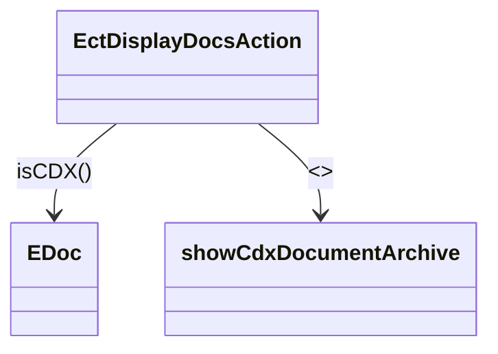

CDX documents appear in the patient encounter screen (eChart) under "Documents". The code to display documents has been modified to use the `showCdxDocumentArchive` page if the document is from CDX.

