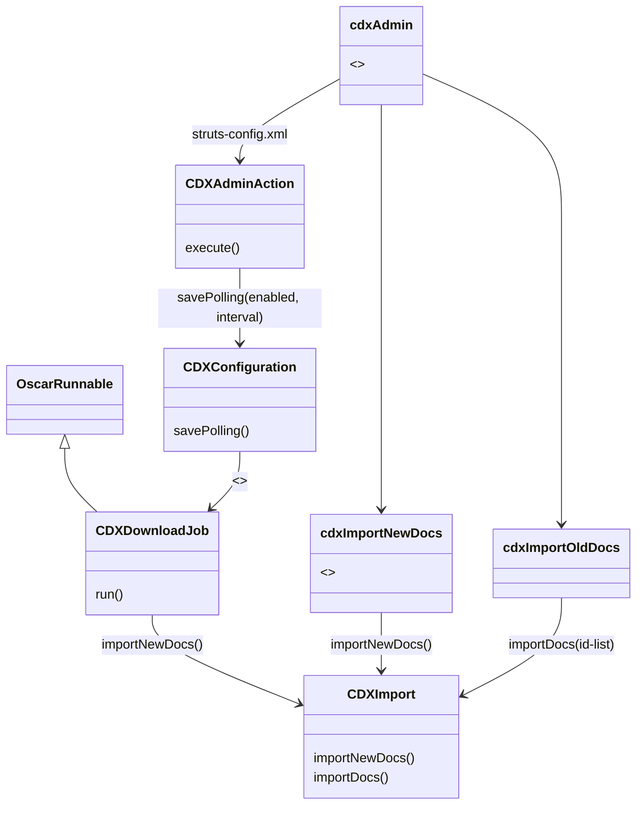
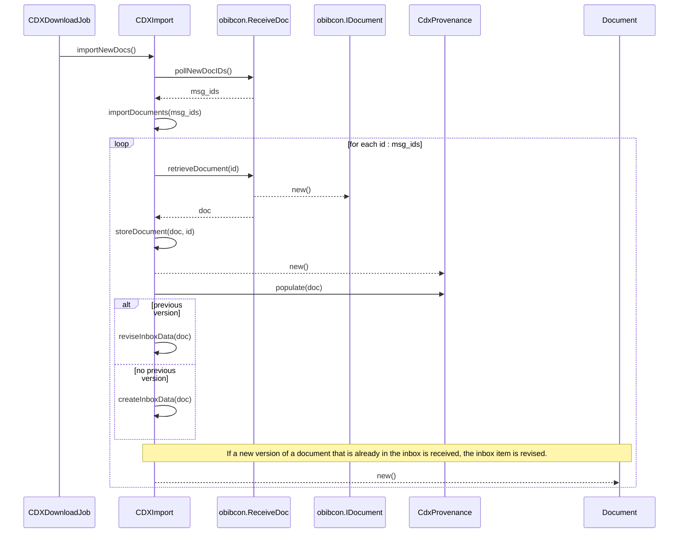

The automatic import of CDX documents is handled by an 'OSCAR job' (see class `CDXDownloadJob`). The download job is configured using class `CDXConfiguration`. The UI for the CDX configuration is implemented as a Java Server Page `cdxAdmin`, which invokes a Struts-action `CDXAdminAction`.

The actual import algorithm is implemented in class `CDXImport`. CDXDownloadJob calls its `importNewDocs` method.

In addition to automatic download, the users can manually trigger the import of new CDX documents. This is implemented with a separate button that loads another JSP (`cdxImportNewDocs`), which invokes the import function.

Finally, the UI also supports manual download of *selected* messages from the CDX infrastructure. This is implemented with a separate button that loads a third JSP (`cdxImportOldDocs`), which invokes a second  import function that takes a list of message IDs (`importDocs`).

