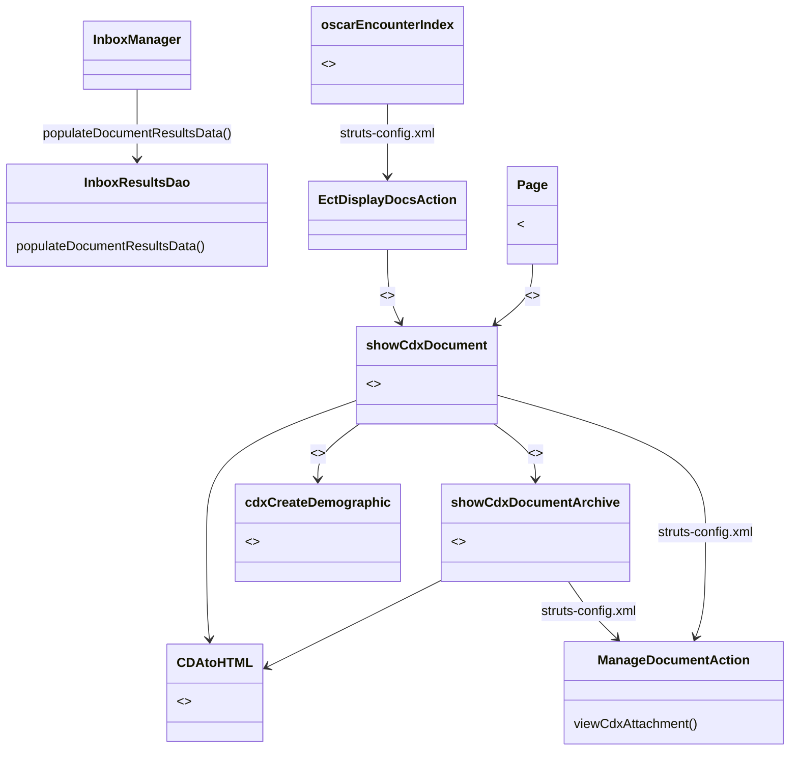

The queries for the Inbox results are implemented in `InboxResultsDao.java`. This class has been extended to return CDX documents in the inbox (see method *populateDocumentResultsData*).

The Inbox is displayed by the Java Server Page `Page.jsp`, which was updated to list CDX documents and launch the CDX document viewing page (`showCdxDocument.JSP`) for these documents.

The `showCdxDocument.JSP` page has special functions that allow users to route documents to different providers, link documents to patients, create new patient demographic records for new patients, delete documents etc. The display of the actual document content uses an approved XSL transform.

There is another JSP that does not provide the above special functions but can only display the document content. This page is called `showCdxDocumentArchive.JSP`. It is used by `showCdxDocument.JSP` to display previous or related versions of the same document.

The functionality to view CDX document attachments is implemented in the Struts action class `ManageDocumentAction`.

CDX documents are also visible from the patient's main encounter screen (echart). That screen is in `oscarEncounter/Index.jsp`. The CDX document display action is added to `EctDisplayDocsAction.java`.

{}
`showCdxDocument` and `showCdxDocumentArchive` share a blog of duplicated code (i.e., a code clone). Any changes to that code block should be propagated to the other file. Removal of that code clone is a future to-do item.
{}
