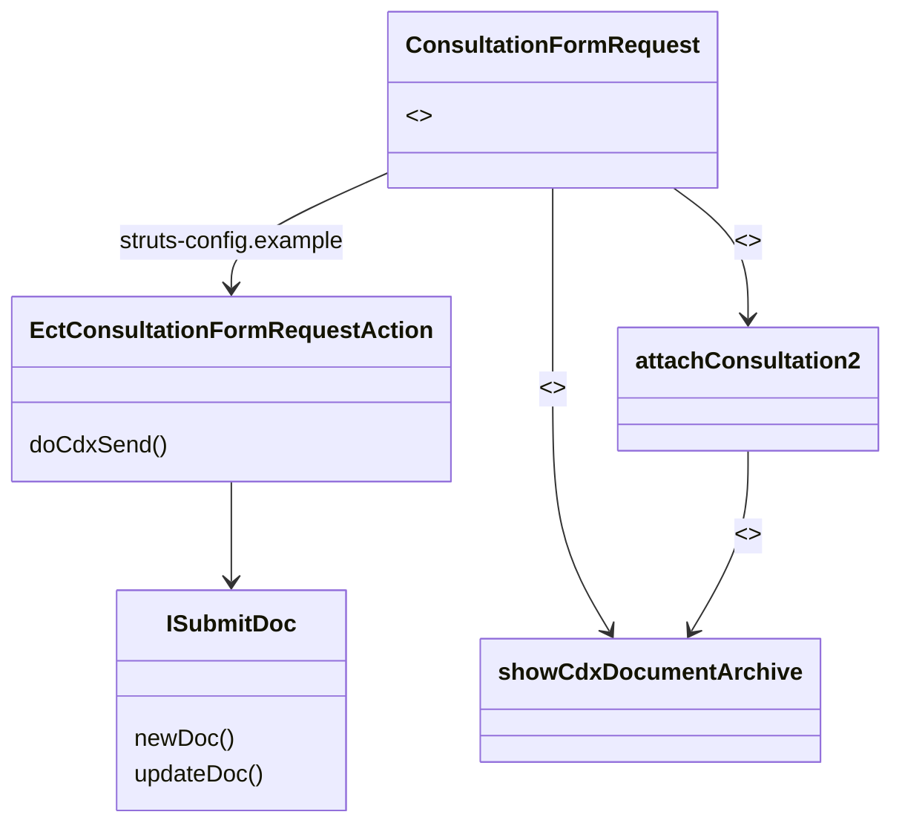

The creation of e-Referrals (called "consultations" in OSCAR) is supported by the Java Server Pages (JSP) page `ConsultationFormRequest.jsp`. Received CDX documents are shown as possible attachments using the `showCdxDocumentArchive` JSP.

The corresponding actions for sending CDX documents are implemented in `EctConsultationFormRequestAction.java`. Sent referral documents and received responses can be shown using `showCdxDocumentArchive` JSP.

CDX documents and their attachments can be attached to consultation requests. (`attachConsultation2` has been extended to allow this.)
