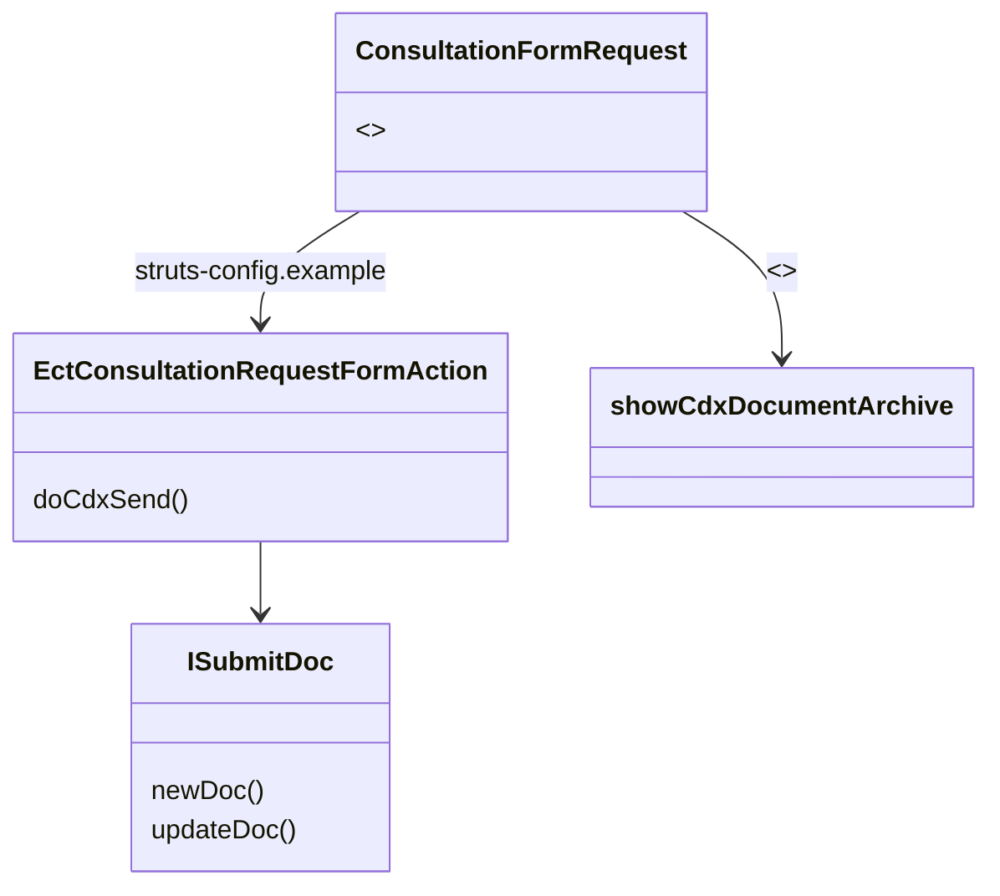

The creation of e-Referrals (called "consultations" in OSCAR) is supported by the Java Server Pages (JSP) page `ConsulationFormRequest.JSP`. The corresponding actions for sending CDX documents are implemented in `EctConsultationRequestFormAction.java`. Sent referral documents and received responses can be shown using `showCdxDocumentArchive` JSP.

